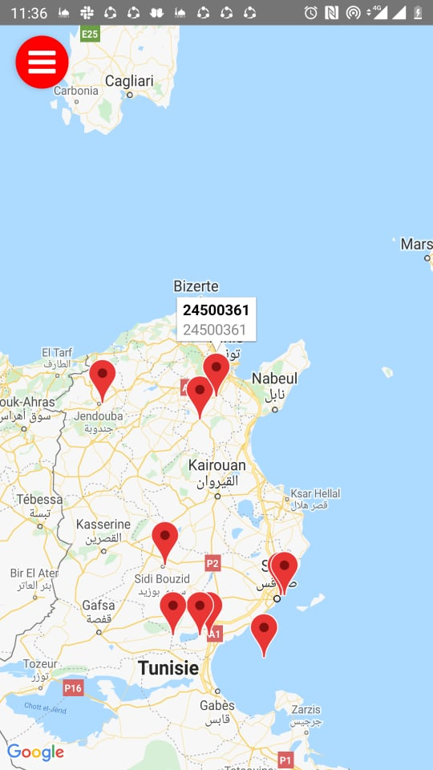
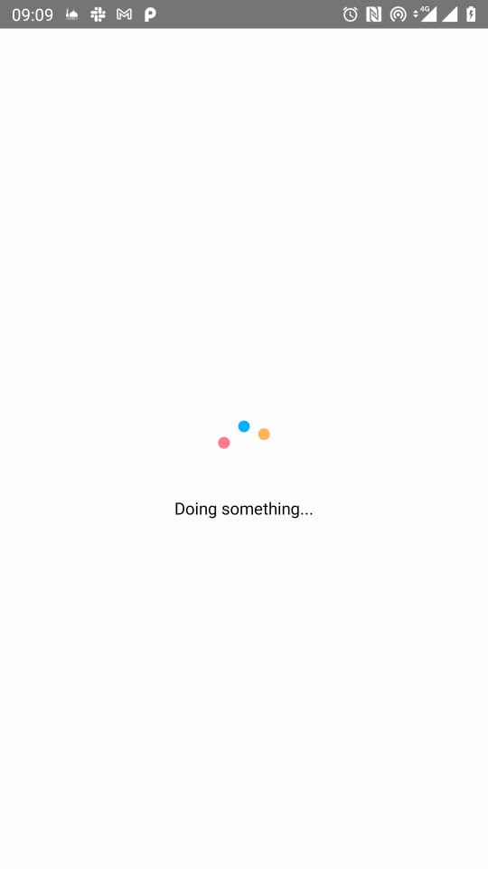
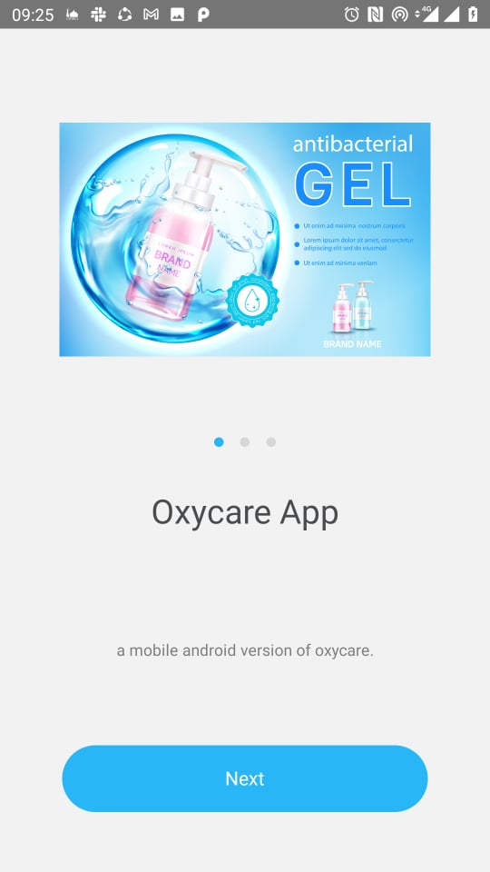
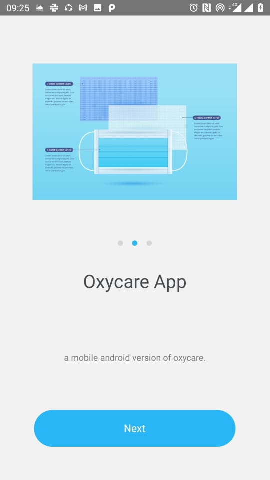
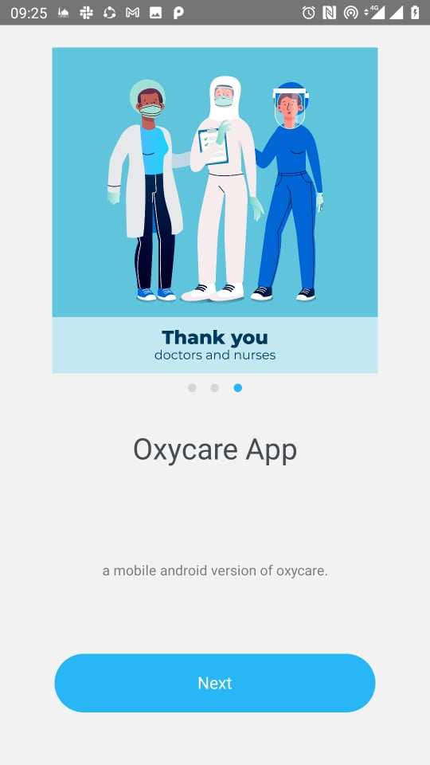

#  oxycare-mobile
a mobile android version of oxycare.
 
 

 
Different environments
Save config for different environments in different files: .env.staging, .env.production, etc.

By default react-native-config will read from .env, but you can change it when building or releasing your app.

The simplest approach is to tell it what file to read with an environment variable, like:

$ ENVFILE=.env.staging react-native run-android           # bash
$ SET ENVFILE=.env.staging && react-native run-android    # windows
$ env:ENVFILE=".env.staging"; react-native run-android    # powershell
This also works for run-ios. Alternatively, there are platform-specific options below.

Android
The same environment variable can be used to assemble releases with a different config:
$ cd android && ENVFILE=.env.staging ./gradlew assembleRelease

## Contributors ✨

Thanks goes to these wonderful people ([emoji key](https://allcontributors.org/docs/en/emoji-key)):

<!-- ALL-CONTRIBUTORS-LIST:START - Do not remove or modify this section -->
<!-- prettier-ignore-start -->
<!-- markdownlint-disable -->
<table>
  <tr>
    <td align="center"><a href=""> <b>FARHATI RIADH</b></a> <a href="" title="Answering Questions">💬</a><a href="" title="Code">💻</a> <a href="https://github.com/tunpl/oxycare-mobile" title="Documentation">📖</a> <a href="https://github.com/tunpl/oxycare-mobile/pulls" title="Reviewed Pull Requests">👀</a> <a href="" title="Talks">📢</a></td>
    <td align="center"><a href=""> <b>elfalehdev</b></a> <a href="#" title="Translation">🌍</a> <a href="" title="Code">💻</a> <a href="" title="Documentation">📖</a></td>
  </tr>
  
  
</table>

